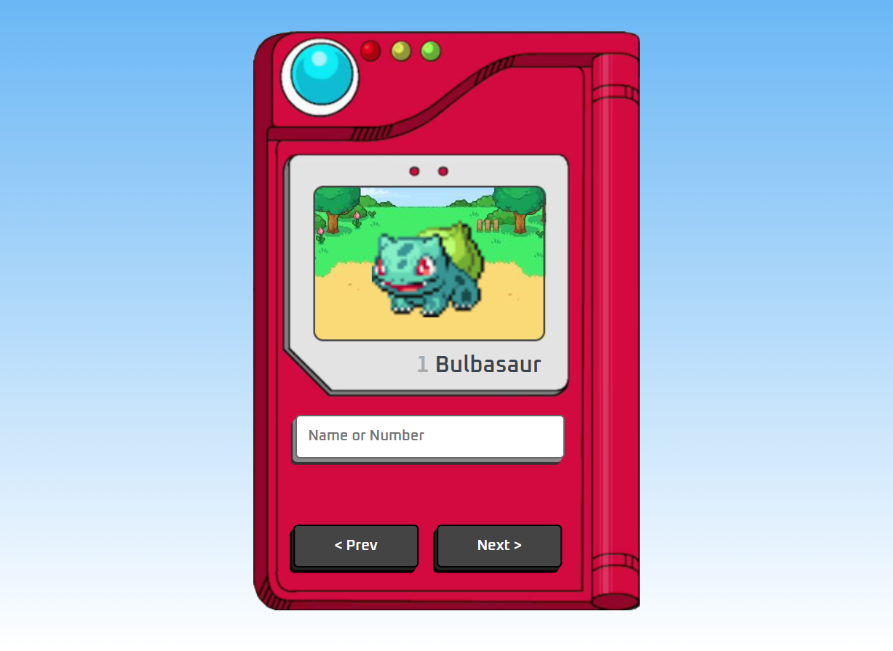

# Pokedex

> Projeto Pokedex  

Projeto construído apartir de um tutorial do Youtube do canal Manual do Dev.

Fiz algumas adaptações para o meu projeto que eu achei interessante fazer e que se adaptavam bem, porém a essência do projeto original se manteve.

## 💻Tecnologias

- HTML
- CSS
- JavaScript
- Git e GitHub

## ✉️Contato

frontcarlos@outlook.com